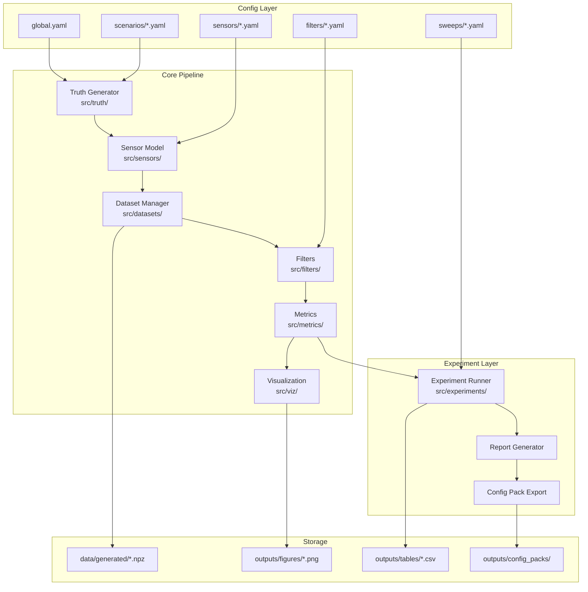

# Design Document: IMU 仿真真值闭环平台

## Overview

本设计文档描述了 IMU 仿真真值闭环平台的技术架构和实现细节。平台采用模块化设计，遵循"先契约后实现"的工程原则，支持配置驱动的功能组合和回归兼容性验证。

核心数据流：
```
Truth Generator → Sensor Model → Dataset → Filter → Metrics → Visualization
                                    ↓
                              Experiment Runner → Config Pack Export
```

## Architecture

### 系统架构图



### 坐标系约定

| 坐标系 | 符号 | 定义 |
|--------|------|------|
| 导航系 (NED) | n | 北-东-地，重力沿 +Z |
| 载体系 (Body) | b | 前-右-下，与 IMU 固连 |
| IMU 系 | s | 传感器坐标系，可能与载体系有安装偏差 |

姿态表示：
- 内部计算：四元数 q = [w, x, y, z]，Hamilton 约定
- 输出显示：欧拉角 [roll, pitch, yaw]，ZYX 顺序

## Components and Interfaces

### 1. Common Utilities (src/common/)

#### math3d.py - 三维数学库
```python
class Quaternion:
    """四元数类，Hamilton 约定"""
    def __init__(self, w: float, x: float, y: float, z: float): ...
    def normalize(self) -> 'Quaternion': ...
    def conjugate(self) -> 'Quaternion': ...
    def to_rotation_matrix(self) -> np.ndarray: ...
    def to_euler(self) -> Tuple[float, float, float]: ...
    @staticmethod
    def from_euler(roll: float, pitch: float, yaw: float) -> 'Quaternion': ...
    @staticmethod
    def from_axis_angle(axis: np.ndarray, angle: float) -> 'Quaternion': ...

def quat_multiply(q1: Quaternion, q2: Quaternion) -> Quaternion: ...
def rotate_vector(q: Quaternion, v: np.ndarray) -> np.ndarray: ...
def skew_symmetric(v: np.ndarray) -> np.ndarray: ...
```

#### random_process.py - 随机过程生成
```python
def white_noise(n: int, sigma: float, rng: np.random.Generator) -> np.ndarray: ...
def random_walk(n: int, sigma: float, dt: float, rng: np.random.Generator) -> np.ndarray: ...
def gauss_markov(n: int, sigma: float, tau: float, dt: float, rng: np.random.Generator) -> np.ndarray: ...
def band_limited_noise(n: int, sigma: float, f_low: float, f_high: float, fs: float, rng: np.random.Generator) -> np.ndarray: ...
```

#### timebase.py - 时间基准
```python
@dataclass
class TimeBase:
    sample_rate: float  # Hz
    duration: float     # seconds
    
    @property
    def dt(self) -> float: ...
    @property
    def n_samples(self) -> int: ...
    @property
    def timestamps(self) -> np.ndarray: ...
```

### 2. Truth Generator (src/truth/)

#### trajectory.py - 轨迹生成
```python
@dataclass
class TruthTrajectory:
    timestamps: np.ndarray      # (N,) 时间戳
    quaternions: np.ndarray     # (N, 4) 姿态四元数
    angular_velocity: np.ndarray # (N, 3) 角速度 rad/s
    linear_acceleration: np.ndarray  # (N, 3) 非重力加速度 m/s^2
    temperature: np.ndarray     # (N,) 温度 Celsius

class TrajectoryGenerator:
    def __init__(self, config: dict, timebase: TimeBase, rng: np.random.Generator): ...
    def generate(self) -> TruthTrajectory: ...
```

#### scenarios.py - 工况库
```python
class ScenarioFactory:
    @staticmethod
    def create(scenario_type: str, config: dict) -> 'BaseScenario': ...

class QuasiStaticScenario(BaseScenario): ...
class SwingScenario(BaseScenario): ...
class AccelScenario(BaseScenario): ...
class TurnScenario(BaseScenario): ...
class VibrationScenario(BaseScenario): ...
class ShockScenario(BaseScenario): ...
class ComboScenario(BaseScenario): ...
```

### 3. Sensor Model (src/sensors/)

#### imu_model.py - IMU 前向模型
```python
@dataclass
class IMUMeasurement:
    gyro: np.ndarray        # (N, 3) 陀螺仪观测 rad/s
    accel: np.ndarray       # (N, 3) 加速度计观测 m/s^2
    gyro_bias_true: np.ndarray   # (N, 3) 真实陀螺偏置
    accel_bias_true: np.ndarray  # (N, 3) 真实加速度偏置

class IMUModel:
    def __init__(self, config: dict, rng: np.random.Generator): ...
    def apply(self, truth: TruthTrajectory, gravity: np.ndarray) -> IMUMeasurement: ...
```

#### error_models.py - 误差模型
```python
class BiasModel:
    """偏置模型：初始偏置 + 随机游走"""
    def __init__(self, initial_bias: np.ndarray, random_walk_sigma: float): ...
    def generate(self, n: int, dt: float, rng: np.random.Generator) -> np.ndarray: ...

class TemperatureDriftModel:
    """温漂模型"""
    def __init__(self, temp_coeff: float, ref_temp: float): ...
    def apply(self, bias: np.ndarray, temperature: np.ndarray) -> np.ndarray: ...

class ScaleMisalignmentModel:
    """比例因子和安装偏差模型"""
    def __init__(self, scale_error: np.ndarray, misalignment: np.ndarray): ...
    def apply(self, measurement: np.ndarray) -> np.ndarray: ...

class QuantizationModel:
    """量化模型"""
    def __init__(self, resolution: int, range_val: float): ...
    def apply(self, measurement: np.ndarray) -> np.ndarray: ...

class SaturationModel:
    """饱和模型"""
    def __init__(self, range_val: float): ...
    def apply(self, measurement: np.ndarray) -> np.ndarray: ...
```

### 4. Dataset Manager (src/datasets/)

#### schema.py - 数据结构定义
```python
@dataclass
class Dataset:
    # Truth namespace
    truth_timestamps: np.ndarray
    truth_quaternions: np.ndarray
    truth_angular_velocity: np.ndarray
    truth_linear_acceleration: np.ndarray
    truth_temperature: np.ndarray
    
    # Measurement namespace
    meas_gyro: np.ndarray
    meas_accel: np.ndarray
    meas_gyro_bias_true: np.ndarray
    meas_accel_bias_true: np.ndarray
    
    # Meta namespace
    meta_config: dict
    meta_timestamp: str
    meta_version: str
    meta_seed: int
```

#### serialize.py - 序列化
```python
def save_dataset(dataset: Dataset, filepath: str) -> None: ...
def load_dataset(filepath: str) -> Dataset: ...
```

### 5. Filters (src/filters/)

#### ekf_fixed.py - 固定参数 EKF
```python
@dataclass
class FilterState:
    quaternion: np.ndarray      # (4,) 姿态估计
    gyro_bias: np.ndarray       # (3,) 陀螺偏置估计
    covariance: np.ndarray      # (6, 6) 协方差矩阵

@dataclass
class FilterOutput:
    states: List[FilterState]   # 每时刻的状态
    innovations: np.ndarray     # (N, 3) 新息序列
    nis: np.ndarray             # (N,) NIS 序列

class EKFFixed:
    def __init__(self, config: dict): ...
    def initialize(self, accel_init: np.ndarray) -> FilterState: ...
    def predict(self, state: FilterState, gyro: np.ndarray, dt: float) -> FilterState: ...
    def update(self, state: FilterState, accel: np.ndarray, gravity: float) -> Tuple[FilterState, np.ndarray, float]: ...
    def run(self, dataset: Dataset) -> FilterOutput: ...
```

#### ekf_adaptive.py - 自适应 EKF
```python
class EKFAdaptive(EKFFixed):
    def __init__(self, config: dict): ...
    def adapt_noise(self, innovations: np.ndarray, predicted_cov: np.ndarray) -> Tuple[float, float]: ...
    # lambda_scale 和 r_acc 的自适应调整
```

### 6. Metrics (src/metrics/)

#### tilt_error.py - 姿态误差
```python
@dataclass
class TiltErrorMetrics:
    roll_rmse: float
    pitch_rmse: float
    yaw_rmse: float
    roll_max: float
    pitch_max: float
    yaw_max: float
    convergence_time: float  # seconds

def compute_tilt_error(truth_quat: np.ndarray, est_quat: np.ndarray, timestamps: np.ndarray) -> TiltErrorMetrics: ...
```

#### consistency.py - 一致性检验
```python
@dataclass
class ConsistencyMetrics:
    nis_mean: float
    nis_std: float
    nis_95_exceed_ratio: float  # 超出 95% 置信区间的比例
    is_consistent: bool         # NIS 均值在 [0.5, 1.5] 范围内

def compute_consistency(nis: np.ndarray, dof: int) -> ConsistencyMetrics: ...
```

### 7. Visualization (src/viz/)

```python
def plot_attitude_comparison(truth: np.ndarray, estimate: np.ndarray, timestamps: np.ndarray, save_path: str) -> None: ...
def plot_error_bands(error: np.ndarray, sigma: np.ndarray, timestamps: np.ndarray, save_path: str) -> None: ...
def plot_nis(nis: np.ndarray, timestamps: np.ndarray, dof: int, save_path: str) -> None: ...
def plot_adaptive_params(lambda_vals: np.ndarray, r_acc_vals: np.ndarray, timestamps: np.ndarray, save_path: str) -> None: ...
```

### 8. Experiments (src/experiments/)

```python
class ExperimentRunner:
    def run_single(self, scenario_config: str, sensor_config: str, filter_config: str) -> dict: ...
    def run_comparison(self, configs: List[dict]) -> pd.DataFrame: ...
    def run_ablation(self, base_config: str, features: List[str]) -> pd.DataFrame: ...
    def run_sensitivity(self, base_config: str, param_grid: dict) -> pd.DataFrame: ...
    def export_config_pack(self, results: dict, pack_name: str) -> None: ...
```

## Data Models

### 配置文件结构

#### global.yaml
```yaml
seed: 42
sample_rate: 100  # Hz
gravity: 9.80665  # m/s^2
paths:
  data_generated: data/generated
  outputs_figures: outputs/figures
  outputs_tables: outputs/tables
  outputs_config_packs: outputs/config_packs
```

#### scenario config
```yaml
scenario:
  name: swing
  duration: 60.0
trajectory:
  type: sinusoidal
  axes: [roll, pitch]
  amplitude: [10.0, 10.0]
  frequency: [0.5, 0.3]
linear_accel:
  enabled: false
temperature:
  enabled: false
  ambient: 25.0
```

#### sensor config
```yaml
sensor:
  name: imu_nominal
gyro:
  noise_density: 0.01
  bias_instability: 0.1
  bias_random_walk: 0.001
accel:
  noise_density: 0.001
  bias_instability: 0.01
  bias_random_walk: 0.0001
```

#### filter config
```yaml
filter:
  name: ekf_adaptive_innovation
  type: ekf
  adaptive: true
process_noise:
  gyro_noise: 0.01
  gyro_bias_rw: 0.0001
measurement_noise:
  accel_noise: 0.1
adaptive:
  method: innovation_based
  window_size: 20
  lambda_min: 0.1
  lambda_max: 10.0
```

### NPZ 数据集结构

```
dataset.npz
├── truth_timestamps      (N,)
├── truth_quaternions     (N, 4)
├── truth_angular_velocity (N, 3)
├── truth_linear_acceleration (N, 3)
├── truth_temperature     (N,)
├── meas_gyro            (N, 3)
├── meas_accel           (N, 3)
├── meas_gyro_bias_true  (N, 3)
├── meas_accel_bias_true (N, 3)
├── meta_config          (dict, pickled)
├── meta_timestamp       (str)
├── meta_version         (str)
└── meta_seed            (int)
```


## Correctness Properties

*A property is a characteristic or behavior that should hold true across all valid executions of a system-essentially, a formal statement about what the system should do. Properties serve as the bridge between human-readable specifications and machine-verifiable correctness guarantees.*

基于需求分析，以下是系统必须满足的正确性属性：

### Property 1: 四元数单位性不变量
*For any* 生成的姿态四元数序列，每个四元数的模长应等于 1（在数值精度范围内）
**Validates: Requirements 1.1**

### Property 2: 时间戳等间隔性
*For any* 采样率和时长配置，生成的时间戳序列长度应等于 `ceil(sample_rate * duration) + 1`，且相邻时间戳间隔应等于 `1/sample_rate`
**Validates: Requirements 1.2**

### Property 3: 数据长度一致性
*For any* 生成的真值轨迹，timestamps、quaternions、angular_velocity、linear_acceleration、temperature 数组的第一维长度应相等
**Validates: Requirements 1.3, 1.4**

### Property 4: 噪声统计特性
*For any* 传感器模型输出，观测值与真值之间的差异（去除偏置后）应符合配置的高斯白噪声统计特性（均值接近 0，标准差接近配置值）
**Validates: Requirements 2.1**

### Property 5: 偏置随机游走特性
*For any* 启用偏置随机游走的传感器模型，偏置序列的差分应符合高斯分布，标准差与配置的随机游走参数一致
**Validates: Requirements 2.2**

### Property 6: 温漂线性关系
*For any* 启用温漂模型的传感器，偏置变化量应与温度变化量成线性关系，斜率等于配置的温度系数
**Validates: Requirements 2.3**

### Property 7: 比例因子和安装偏差变换
*For any* 启用 scale/misalignment 模型的传感器，输出应等于输入乘以配置的变换矩阵
**Validates: Requirements 2.4**

### Property 8: 饱和限幅
*For any* 启用饱和模型的传感器输出，所有值应在配置的量程范围 [-range, +range] 内
**Validates: Requirements 2.5**

### Property 9: 量化步长
*For any* 启用量化模型的传感器输出，所有值应为量化步长的整数倍（在数值精度范围内）
**Validates: Requirements 2.5**

### Property 10: 数据集 Round-Trip
*For any* 有效的 Dataset 对象，保存为 NPZ 文件后再加载，恢复的数据应与原始数据在数值精度范围内完全一致
**Validates: Requirements 3.2, 10.2, 10.3**

### Property 11: 元数据完整性
*For any* 保存的数据集，meta 命名空间应包含 config、timestamp、version、seed 字段
**Validates: Requirements 3.3**

### Property 12: EKF 协方差正定性
*For any* EKF 滤波过程中的协方差矩阵，应保持对称正定（所有特征值大于 0）
**Validates: Requirements 4.1**

### Property 13: Baseline 模式参数不变性
*For any* baseline 模式的 EKF 运行，过程噪声和观测噪声参数在整个滤波过程中应保持不变
**Validates: Requirements 4.2**

### Property 14: 自适应参数边界
*For any* 自适应模式的 EKF 运行，λ 和 R_acc 参数应始终在配置的 [min, max] 范围内
**Validates: Requirements 4.3**

### Property 15: 滤波输出长度一致性
*For any* EKF 滤波输出，states、innovations、nis 序列长度应与输入数据长度一致
**Validates: Requirements 4.4, 4.5**

### Property 16: 零误差情况
*For any* 估计姿态等于真值姿态的情况，计算的姿态误差应为零向量
**Validates: Requirements 5.1**

### Property 17: RMSE 非负性
*For any* 姿态误差序列，计算的 RMSE 应为非负值
**Validates: Requirements 5.2**

### Property 18: NIS 统计正确性
*For any* NIS 序列，计算的均值应等于序列的算术平均值，95% 超出比例应等于超出 chi2.ppf(0.95, dof) 的样本比例
**Validates: Requirements 5.3**

### Property 19: 实验结果完整性
*For any* 实验配置列表，运行完成后的结果表格应包含与配置数量相等的行数
**Validates: Requirements 7.1, 7.2**

### Property 20: 消融实验覆盖性
*For any* 消融实验配置，结果应包含 2^n 种组合（n 为功能数量）
**Validates: Requirements 7.3**

### Property 21: 敏感性分析覆盖性
*For any* 敏感性分析配置，结果应包含所有参数网格点的组合
**Validates: Requirements 7.4**

### Property 22: 配置包有效性
*For any* 导出的配置包，其中的 YAML 文件应能被正确解析，且包含 parameters、boundaries、expected_performance 字段
**Validates: Requirements 8.1, 8.2, 8.3**

### Property 23: 配置验证
*For any* 有效的 YAML 配置文件，Config Loader 应成功解析；*For any* 无效的配置（缺少必需字段或参数超出范围），Config Loader 应抛出明确的错误
**Validates: Requirements 9.1, 9.4**

### Property 24: 模块禁用隔离性
*For any* 禁用某功能模块的配置，该模块的输出字段应为空或默认值，其他模块的输出应不受影响
**Validates: Requirements 9.2**

### Property 25: 回归兼容性
*For any* 相同的随机种子和基线配置（所有扩展功能禁用），多次运行应产生完全相同的输出
**Validates: Requirements 9.3**

### Property 26: YAML Round-Trip
*For any* 有效的配置字典，序列化为 YAML 后再解析，应恢复等价的字典结构
**Validates: Requirements 10.4**

## Error Handling

### 配置错误
- 缺少必需字段：抛出 `ConfigurationError`，包含缺失字段名称
- 参数超出范围：抛出 `ValidationError`，包含参数名称和有效范围
- 文件不存在：抛出 `FileNotFoundError`，包含文件路径

### 数值错误
- 四元数非单位：自动归一化并记录警告
- 协方差矩阵非正定：重置为对角矩阵并记录警告
- NaN/Inf 值：抛出 `NumericalError`，包含发生位置

### 文件 I/O 错误
- 写入失败：抛出 `IOError`，包含文件路径和原因
- 读取失败：抛出 `IOError`，包含文件路径和原因
- 格式错误：抛出 `FormatError`，包含期望格式和实际内容

## Testing Strategy

### 测试框架
- 单元测试：pytest
- 属性测试：hypothesis（Python PBT 库）
- 测试配置：每个属性测试运行至少 100 次迭代

### 单元测试
单元测试覆盖：
- 边界条件（空输入、单元素输入）
- 特殊值（零向量、单位四元数）
- 错误处理路径

### 属性测试
每个正确性属性对应一个属性测试，使用 hypothesis 生成随机输入：

```python
from hypothesis import given, strategies as st, settings

@settings(max_examples=100)
@given(
    sample_rate=st.floats(min_value=10, max_value=1000),
    duration=st.floats(min_value=0.1, max_value=100)
)
def test_timestamp_interval_property(sample_rate, duration):
    """
    **Feature: imu-simulation-platform, Property 2: 时间戳等间隔性**
    **Validates: Requirements 1.2**
    """
    timebase = TimeBase(sample_rate=sample_rate, duration=duration)
    timestamps = timebase.timestamps
    intervals = np.diff(timestamps)
    expected_dt = 1.0 / sample_rate
    assert np.allclose(intervals, expected_dt, rtol=1e-10)
```

### 测试文件组织
```
tests/
├── test_math3d.py           # 数学库测试
├── test_truth_generator.py  # 真值生成测试
├── test_sensor_model.py     # 传感器模型测试
├── test_dataset.py          # 数据集管理测试
├── test_filters.py          # 滤波器测试
├── test_metrics.py          # 指标计算测试
├── test_config.py           # 配置管理测试
└── test_roundtrip.py        # Round-trip 测试
```
